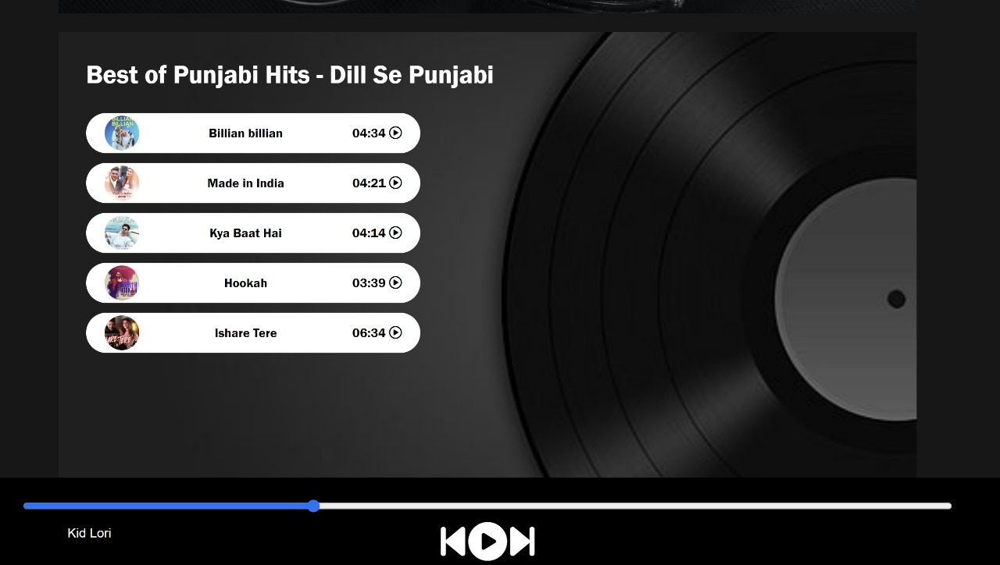

# Music Player Web App

The Music Player Project is a web application developed using HTML, CSS & JavaScript.

## Demo Images

## Key Features

- User-Friendly Interface
- Playback

## 🛠 Skills

- HTML
- CSS
- JavaScript